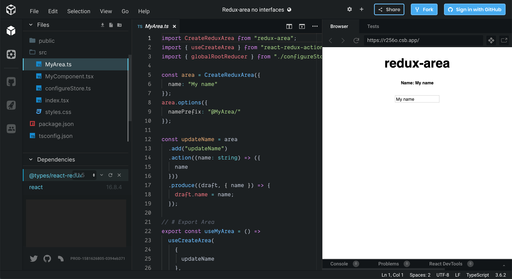

# Redux-area

**Short:** `Simplified strongly typed redux`

_(version 0.4.x)_

When defining redux actions and reducers with typescript,
you often need a lot of typing for interfaces to ensure that you can use your actions,
action-creators and reducers with autocompletion ect.

redux-area tries to simplify creation of redux logic by hiding / calculating types,
and thereby holding the code more clean.

It uses the [immer](https://github.com/immerjs/immer) npm module for keeping the reducers as simple as possible.

> You can create normal reducers if you need them

Github [Source](https://github.com/alfnielsen/redux-area) Code

The npm [package](https://www.npmjs.com/package/redux-area)

See Github Wiki for full [Documentation](https://github.com/alfnielsen/redux-area/wiki).

The wiki includes all new options and features and a guide for upgrading from v0.2.x to v0.4.x

**The goal is:** to ease and reduce the amount of code we need to write to get all benefits of both

- redux _(single truth, deterministic state transition and view rendering, time travel ect..)_
  and
- typescript _(strongly typed symbols and interfaces, code checking/nullable check, auto-rewriting, autocompletion, auto-importing ect..)_.

## Usage

MyArea.ts

```ts
import { FetchAreaBase } from 'redux-area'

// State (Optional)
export interface IMyAreaState {
   name: string,
   loading: boolean
   error?: Error
}

// Create Area
const area = FetchAreaBase("MyApp").CreateArea({
   namePrefix: 'MyArea',
   state: {
     name: ''
   }
)

// Add single action
const updateName = area
   .add('updateName')
   .action((name: string) => ({
      name
   }))
   .produce((draft, { name }) => {
      draft.name = name
   })

// Add single empty action (action has only a type and no other values)
const clearName = area
   .add('clearName')
   .produce(draft => {
      draft.name = ''
   })

// Add fetch action (3 actions)
const getName = area
   .addFetch('getName')
   .action((id: number) => ({ id }))
   .produce((draft) => {
      draft.name = ''
   })
   .successAction((name: string) => ({ name }))
   .successProduce((draft, { name }) => {
      draft.name = name
   })
   .failureAction((error: Error) => ({ error }))
   .failureProduce((draft, { error }) => {
      draft.error = error
   })

// We don't need to add empty action (They will still be created in the 'getNewName')
export const getNewName = area
   .addFetch('getNewName')
   .successAction((newName: string) => ({ newName }))
   .successProduce((draft, { newName }) => {
      draft.name = newName
   })
   .baseFailure()

// Export Redux actions
export const MyAreaActions = {
   updateName,
   clearName,
   getNameFetch: getName.fetch,
   getNameSuccess: getName.success,
   getNameFailure: getName.failure,
   // By exporting the 'getNewName',
   // Saga's ect. can get the success and failure methods,
   // and you only have to expose then fetch to views.
   // (Or you can add all like the 'getName')
   getNewName: getNewName.fetch
}
// You can get the action type definition for Saga's, custom reducers, ect. like this:
type UpdateNameActionType = typeof updateName.type

// Export initial state for area
export const MyAreaInitState = area.initialState
// Export root-reducer for area
export const MyAreaRootReducer = area.rootReducer()
```

## Install

```sh
npm install redux-area
```

Or

```sh
yarn add redux-area
```

## Demo

_(editable codesandbox.io)_

Demo: [Demo in React](https://codesandbox.io/s/redux-area-base-ex-tb1lr?fontsize=14&hidenavigation=1&theme=dark)

[](https://codesandbox.io/s/redux-area-base-ex-tb1lr?fontsize=14&hidenavigation=1&theme=dark)
